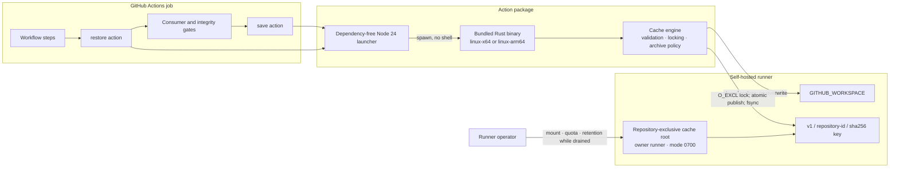

# Architecture and lifecycle

The public interface is two explicit GitHub Actions. Each action starts through GitHub's Node 24 runtime, but the launcher only checks the platform and executes the matching bundled Rust binary with `shell: false`. All input parsing, filesystem access, tar/zstd handling, locking, validation, and outputs are implemented in Rust.

## Architecture



The repository ID is organizational defense in depth, not permission isolation. Separate repositories must not share a writable cache root.

## Restore and save sequence

```mermaid
sequenceDiagram
    autonumber
    participant W as Workflow
    participant A as Node launcher
    participant R as Rust engine
    participant C as Cache root
    participant S as Private staging
    participant X as Workspace

    W->>A: restore(path, key, restore-keys)
    A->>R: exec bundled binary (no shell)
    R->>C: validate root and exact digest entry
    alt valid exact entry
        C-->>R: verified metadata + payload
    else corrupt exact entry
        R->>C: acquire lock and quarantine
        R->>C: scan at most 256 ordered fallback records
    else exact miss
        R->>C: scan at most 256 ordered fallback records
    end
    alt exact or fallback selected
        R->>R: verify compressed size and SHA-256
        R->>S: reject traversal, links, specials, conflicts, and limits
        R->>X: fail if any top-level destination exists
        R->>X: rename staged top-level paths; roll back on failure
        R-->>W: cache-match exact or fallback
    else no valid candidate
        R-->>W: cache-match miss
    end

    W->>W: generate or consume; run integrity gates
    W->>A: save(path, key) only after success
    A->>R: exec bundled binary (no shell)
    R->>R: expand, sort, deduplicate, snapshot, reject links/specials
    R->>C: acquire digest.lock with O_CREAT|O_EXCL
    alt complete winner already exists
        R->>C: validate winner
        R-->>W: cache-save raced
    else this writer wins
        R->>S: stream tar.zst and recheck source stats
        R->>S: fsync payload, metadata, complete, directory
        R->>C: atomic rename and fsync parent
        R-->>W: cache-save saved
    end
```

## Entry layout

```text
<cache-root>/v1/<repository-id>/<sha256(key)>/
  metadata.json
  payload.tar.zst
  complete
```

Complete entries are immutable from the action's perspective. A concurrent loser validates the winner and reports `raced`; it never replaces the published entry.
